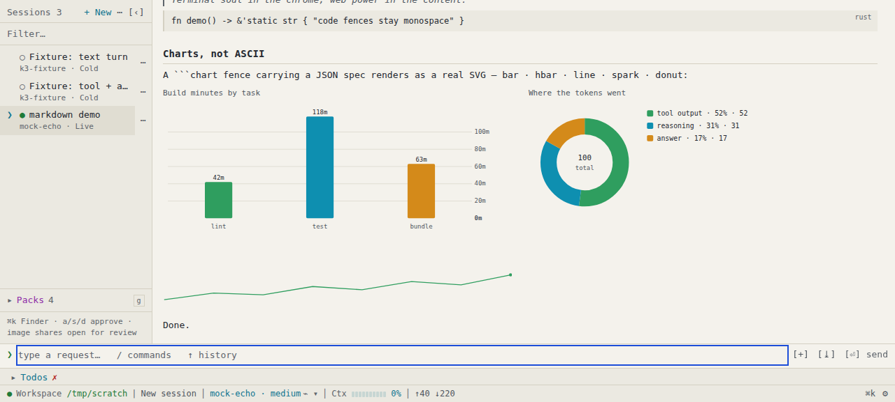
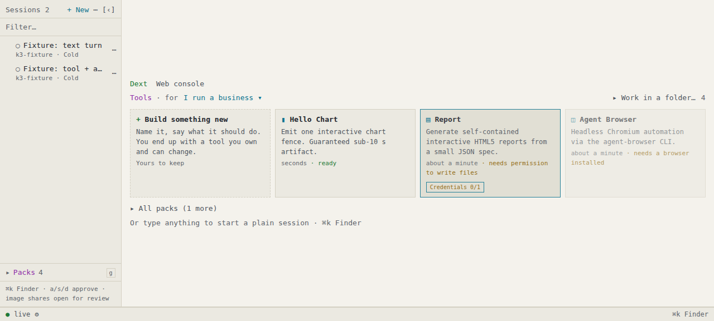

# DextUI

A web front end for the [dext](https://github.com/SiliconState/Dext) coding
agent, consumer-friendly for people delegating work, agent-drivable for the
agents doing it. The host journals every session event with a monotonic `seq`;
the app folds that journal into a live, terminal-native UI. dext does the
thinking; DextUI presents, supervises, and gets out of the way.



## Quickstart

```bash
npm install
npm run build
npm run serve -- --cwd=$HOME/my-project --approval=auto-read
```

Open http://127.0.0.1:8788 and pair with the printed token. Every prompt runs a
real dext turn in `--cwd`; follow-ups resume the same session.

No API key? `npm run mock` starts a fixture host on http://127.0.0.1:8787
(token `dev-token`).

After pulling changes: web-only needs `npm run build` plus a tab reload (the
host serves `apps/web/dist` from disk); host changes need an `agentlinkd`
restart.

Useful flags: `--port` · `--token` · `--dext` (auto-detects the binary) ·
`--approval` · `--state-dir` (journals; default `~/.dextui/agentlinkd`) ·
`--crew` · `--safe` (serve the last-known-good build).

## Highlights

- **Multi-session rail**: cold/wake restore, rename, true-purge delete,
  `Ctrl+[`/`]` cycling
- **One action queue**: every pending approval across all sessions, `a`/`s`/`d`
  keyboard decisions, desktop notifications
- **Steering, interrupt, `/compact`**: queue input mid-turn, stop cleanly,
  compact context against a core-verified meter
- **Real rendering**: markdown, interactive charts, inline images, a sandboxed
  HTML artifact sheet, attachments with a consent-labeled `read_image` handoff
- **Pack gallery home**: persona onboarding and starter prompts; packs run as
  first-class turns ([packs/README.md](packs/README.md))
- **Flows**: a drag-and-drop canvas that compiles to crew runs, with
  schedule/watch/mesh/webhook triggers ([docs/PROTOCOL.md](docs/PROTOCOL.md))
- **Shared tasks**: one durable `.task.json` both you and the agent hold;
  rev-checked, `done` requires a passing check
- **Crew runs**: rail ticker, run sheet and escalation queue when a `crew`
  binary is present ([docs/crew-live-monitoring.md](docs/crew-live-monitoring.md))
- **Self-editing workbench**: staged build/swap/rollback and idle restart of
  the host itself ([docs/DESIGN.md](docs/DESIGN.md))
- **Agent-drivable**: stable `data-agent-id` hooks on every control, a bounded
  `GET /__agent` scene digest



## Repository layout

| Path | What it is |
|---|---|
| `apps/web` | Svelte 5 PWA, hand-rolled terminal design system (no CSS framework) |
| `packages/protocol` | AgentLink v1 types + envelope helpers (`@dextui/protocol`) |
| `packages/client` | Framework-free `Connection` + `SessionStore` (WS, seq-resume, reconnect) |
| `packages/agentlinkd` | Real host: dext bridge, seat resume, on-disk journals |
| `packages/mock-server` | Fixture-replay mock host, no API key needed |
| `packs/` | Consumer packs ("Rust core, TS panel") + SDKs |
| `docs/` | Protocol, design notes, upstream spec, reviews, screenshots |

## Verification

```bash
npm test                 # unit + fold-equivalence suites, then a real-browser
                         # smoke (visibly skips where agent-browser is absent)
npm run smoke            # mock host end-to-end
npm run smoke:agentlinkd # real-host surface against a fake dext
```

## Documentation

| Document | What it covers |
|---|---|
| [docs/PROTOCOL.md](docs/PROTOCOL.md) | AgentLink v1 wire format, WS + REST, capability negotiation, flows/tasks contracts |
| [docs/DESIGN.md](docs/DESIGN.md) | Design notes, theming contract, development gates, repo map, milestones |
| [docs/UPSTREAM.md](docs/UPSTREAM.md) | `dext bridge` PR spec, the path to live steering and interactive approvals |
| [packs/README.md](packs/README.md) | Consumer pack architecture and gallery metadata |
| [docs/crew-live-monitoring.md](docs/crew-live-monitoring.md) | Crew run monitoring design |
| [docs/packs-day1-assessment.md](docs/packs-day1-assessment.md) | Pack gallery assessment and proposal deviations |
| [docs/chart-report-review.md](docs/chart-report-review.md) | Chart and market-report review: findings, methodology, limits |
| [docs/dext-core-handoff-packs.md](docs/dext-core-handoff-packs.md) | Pack registry handoff notes for dext core |
| [docs/workspace-DEXT.example.md](docs/workspace-DEXT.example.md) | Example workspace `DEXT.md` policy |
| [docs/screenshots/](docs/screenshots) | More UI captures (approvals, themes, mobile, responsive) |
